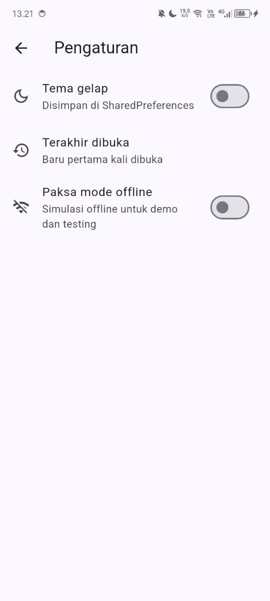
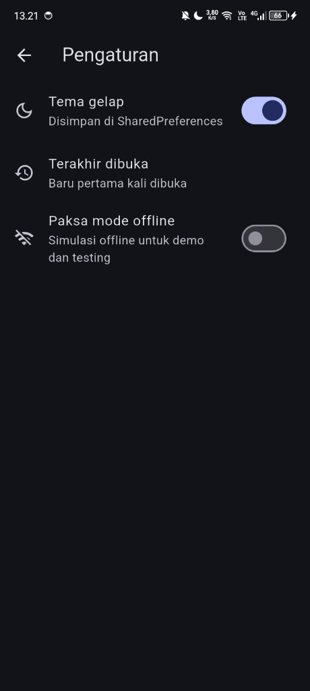
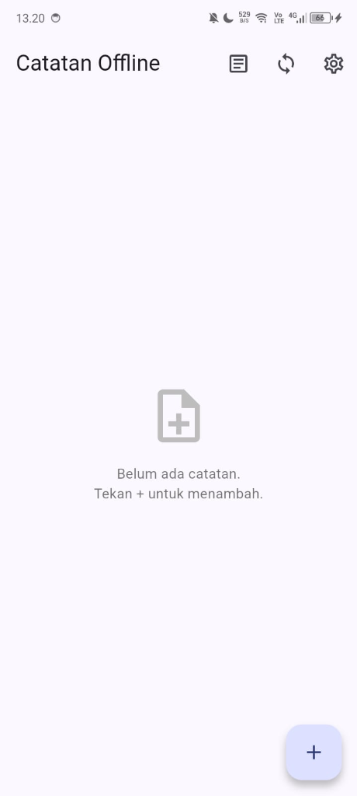
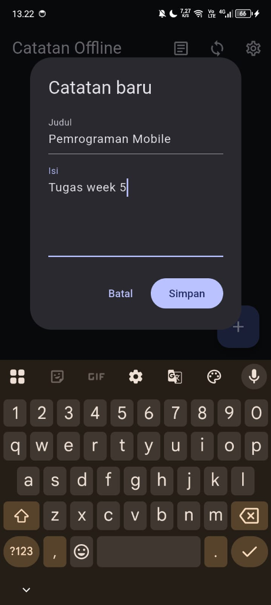
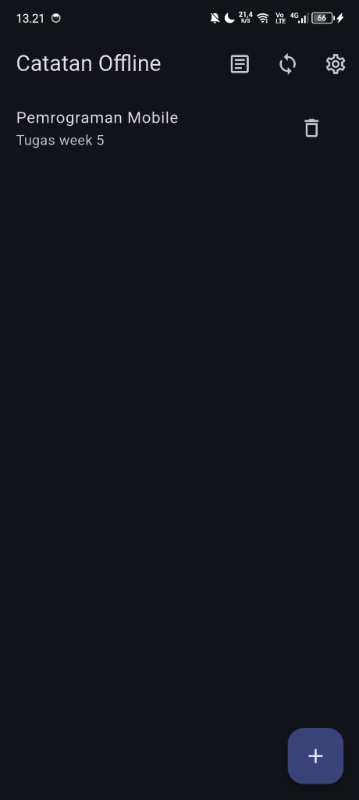
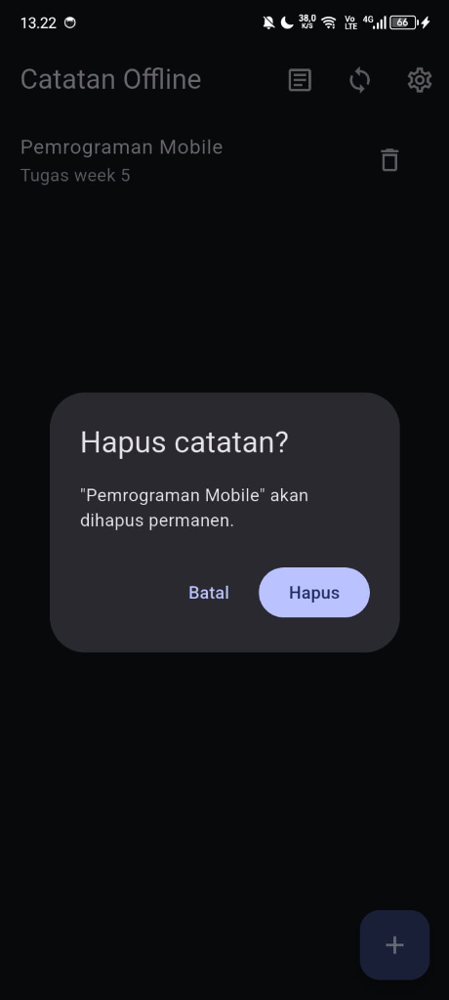
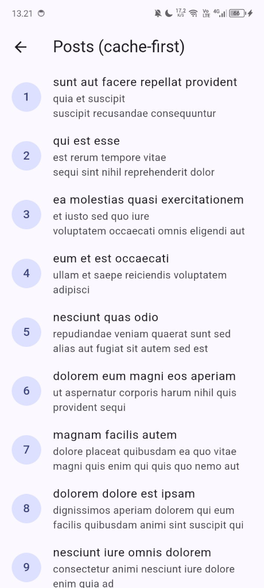
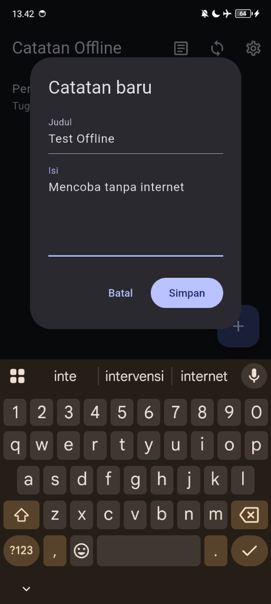
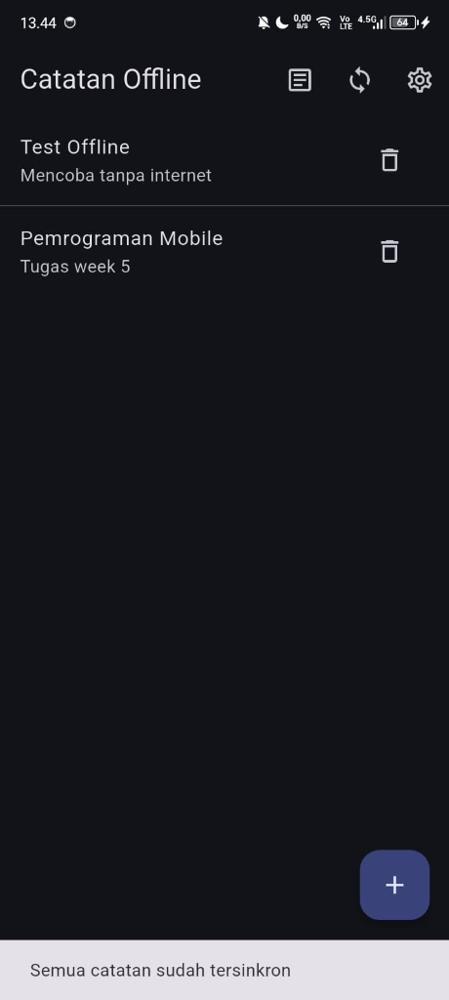
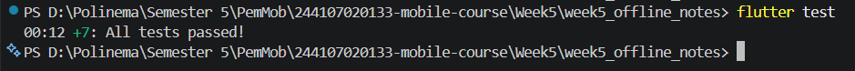

# Laporan Praktikum Minggu 5: Local Storage & Offline First

## 1. Identitas
- **Nama**: Marsyalia Fernanda
- **NIM**: 244107020133
- **Kelas**: TI-3C
- **Tautan Repository**: https://github.com/arxsyy/244107020133-mobile-course

---

## 2. Hasil Setiap Praktikum (1–5)

### Praktikum 1: Preferensi dengan SharedPreferences
**Penjelasan Singkat:**
Praktikum ini membuat penyimpanan pengaturan/preferensi (berupa tema *dark mode* dan waktu terakhir aplikasi dibuka) dengan `SharedPreferences`. Data yang disimpan merupakan *key-value* primitif ringan agar settingan tetap persisten saat aplikasi dibuka kembali.

**Screenshot Hasil:**

  
  

### Praktikum 2 & 3: Model, Database SQLite, Halaman Catatan Offline & Riverpod
**Penjelasan Singkat:**
Menyambungkan UI dengan `NoteRepository` melalui Riverpod (`notesProvider`, `dirtyCountProvider`). Terdapat penanganan 4 *state* (*loading*, *error*, *empty*, *success*) agar UX baik saat terjadi jeda atau ketika catatan kosong. Database diatur melalui `sqflite`.

**Screenshot Hasil (Empty State, Create, List, & Delete):**

  
  
  
  

### Praktikum 4: Cache-first & Sinkronisasi
**Penjelasan Singkat:**
Penerapan arsitektur **Offline-First**. Diimplementasikan skenario `cache-first` untuk daftar `posts` (API luar) serta *flag* `dirty` (antrean *sync*) untuk `notes`. Pengguna dapat mencoba sinkronisasi yang dikendalikan oleh "saklar offline". Aturan penyelesaian konflik juga telah dirancang menggunakan metode *Last-Write-Wins*.

**Screenshot Hasil (Daftar Posts dari Cache & Simulasi Offline Sync):**

  
  
  

### Praktikum 5: Pengujian dengan Repository Palsu
**Penjelasan Singkat:**
Modul mengarahkan pembuatan `FakeNoteRepository` untuk me-*mock* operasi database sehingga aplikasi dapat menjalankan *unit testing* model, provider, dan *sync logic* murni tanpa I/O DB secara cepat (menghindari instabilitas jika memakai DB nyata).

**Screenshot Hasil (Semua Test Lulus):**

  

---

## 3. Jawaban Pertanyaan Praktikum

### Pertanyaan Praktikum 1
1. **Mengapa `SharedPreferences.getInstance()` tidak boleh dipanggil di dalam method `build()` widget?**
   **Jawaban:** `build()` bisa dipanggil berkali-kali (setiap *rebuild*) dan harus sinkron. Memanggil operasi *async* di sana menimbulkan pemanggilan/pembacaan berulang-ulang, kedipan UI, dan aplikasi menjadi sulit untuk diuji. Dengan dipisah di *Repository + Provider*, data dapat di-*cache* dan mudah di-*override* untuk *testing*.
2. **Jelaskan alur data dari saat switch ditekan sampai nilai tersimpan di disk dan tema berubah.**
   **Jawaban:** Switch ditekan -> method `toggle()` dipanggil -> nilai *state* langsung diganti ke `AsyncData(next)` secara *optimistic* -> UI (`MaterialApp` yang *watch* provider) *rebuild* (tema langsung berubah) -> memanggil repository untuk menulis `bool` ke disk/XML Android -> nilai persisten tersimpan. Saat dibuka lagi, `build()` provider akan menarik nilainya dari disk.
3. **Apa kelebihan dan risiko pendekatan *optimistic update* pada `toggle()`?**
   **Jawaban:** **Kelebihan**: UI merespons perubahan pengguna secara instan tanpa kedipan/jeda waktu *loading* disk. **Risiko**: UI sempat menampilkan nilai yang ternyata gagal disimpan oleh sistem. Oleh karena itu, diterapkan *rollback* *state* di dalam blok `catch` bila penyimpanan gagal.

### Pertanyaan Praktikum 2
1. **Mengapa kolom `dirty` bertipe INTEGER dan bukan BOOLEAN?**
   **Jawaban:** Karena bawaan engine SQLite tidak memiliki tipe khusus BOOLEAN asli. Konvensi praktisnya, tipe true/false disimpan sebagai 1/0 dan baru dikonversi di dalam factory `toMap()` / `fromMap()`.
2. **Apa fungsi parameter `openDb` pada constructor `NoteRepository`?**
   **Jawaban:** Ini adalah contoh pola *Dependency Injection*. Parameter ini berguna agar saat masa uji coba (Test), fungsi buka database asli dapat dipotong atau digantikan dengan *Fake Database/In-Memory* yang akan melempar *error*, sehingga tidak menimpa DB produksi saat *testing*.
3. **Mengapa query memakai `where: 'id = ?'` dan `whereArgs`, bukan interpolasi string?**
   **Jawaban:** Mengamankan database dari serangan tipe SQL Injection, serta meminimalisir *crash* akibat salah *escaping* karakter khusus (seperti tanda petik yang dimasukkan secara paksa oleh *user*).
4. **Apa yang terjadi jika Anda menambah kolom baru di `onCreate` tanpa menaikkan `version`?**
   **Jawaban:** Method `onCreate` tidak akan pernah dijalankan ulang karena berkas DB dengan versi yang sama sudah telanjur terbentuk. Hasilnya adalah pesan *error* "no such column" saat kita mencoba *insert/select* ke kolom baru tersebut.

### Pertanyaan Praktikum 3
1. **Mengapa setelah setiap mutasi perlu meng-invalidate `notesProvider` dan `dirtyCountProvider`? Apa yang terjadi jika hanya salah satu?**
   **Jawaban:** Keduanya secara hakikat me-*listen* sumber data yang sama dari aspek yang berbeda. Jika hanya `notesProvider` yang *invalidate*, maka tampilan *list* catatan berubah tapi lencana (*badge*) awan "belum tersinkron" tak akan berkurang. Sebaliknya, bila hanya `dirtyCountProvider`, *badge* berubah tapi tampilan list catatan tetap using.
2. **Bagaimana cara Anda memicu state *error* secara sengaja untuk menguji tampilan `_ErrorView`?**
   **Jawaban:** Kita bisa meng-*override* `noteRepositoryProvider` dan menyuntikkannya dengan Mock Repository yang sengaja di-set untuk membuang (`throw`) `Exception`. Bisa juga dengan menyengajakan kesalahan ketik pada tabel database lewat kode asli agar gagal diambil datanya.
3. **Mengapa aplikasi tetap berfungsi dalam mode pesawat walaupun tidak ada kode khusus untuk mode offline?**
   **Jawaban:** Arsitektur kita dirancang dengan mode "Local-First". Semua instruksi baca/tulis aplikasi murni berhadapan dengan SQLite (*file system* lokal) dan tidak melakukan transmisi HTTP (internet). Hal ini menyebabkan fungsionalitas CRUD secara mandiri tetap dapat hidup tanpa jaringan.

### Pertanyaan Praktikum 4
1. **Apa perbedaan *cache-first* dan *network-first*? Berikan satu contoh data yang lebih cocok memakai *network-first*.**
   **Jawaban:** *Cache-first* akan memberikan respon secepat mungkin dari memory/disk lokal sebelum perlahan *update* belakang layar. Sangat cocok bagi UI yang butuh kecepetan namun toleran informasi usang semisal post/artikel blog. *Network-first* di sisi lain memprioritaskan server dan baru memanggil cadangan cache jika *offline*. Ini amat penting pada data bernilai absolut dan sensitif semisal nominal cek Saldo, Harga Saham *Real-time*, dan Stok Gudang Ekspedisi.
2. **Jelaskan skenario kehilangan data yang dapat terjadi akibat `markAllSynced()`, lalu usulkan perbaikannya.**
   **Jawaban:** Pada saat sinkronisasi API *upload* berjalan lambat di *background*, *user* mungkin kebetulan menyunting ("meng-update") salah satu catatan yang ada di dalam antrean. Saat API selesai dengan jeda telat, *method* `markAllSynced` buta (*blindly*) memukul rata dan merubah `dirty=0` untuk SEMUA baris. Padahal revisi terbaru *user* itu belum ter-*upload*. Perbaikan: Lakukan penandaan sinkron berdasarkan pasangan presisi ID + UpdatedAt yang berhasil diunggah (`WHERE id = ? AND updated_at = ?`), atau gunakan tabel Outbox terpisah.
3. **Mengapa diperlukan saklar `forceOffline` padahal sudah ada mode pesawat?**
   **Jawaban:** Fitur *Flight-mode* sungguhan terlalu lambat disimulasikan setiap saat secara manual untuk keperluan otomatisasi *Test*. *Switch Force Offline* memberikan jalan yang instan dan *deterministik* secara logik kode untuk membuat "seolah-olah" aplikasi kehilangan jaringan, tanpa menghancurkan jaringan pada level sistem OS HP.
4. **Mengapa `fetchAndCache()` menulis cache di dalam transaksi?**
   **Jawaban:** Menghapus yang usang (`delete`) kemudian me-masukkan (`insert`) ratusan data ter-update tidaklah *instan*. Bila sistem tiba-tiba *crash* di pertengahan (*power failure* atau API terputus), *Transaction* berjanji bahwa operasi ini tak akan merusak *database* (operasi separo jalan tak ada; entah masuk seluruhnya, atau dibatalkan seutuhnya).

### Pertanyaan Praktikum 5
1. **Mengapa kita menguji provider dengan `ProviderContainer + overrideWithValue` dan bukan dengan membuka database asli?**
   **Jawaban:** Database orisinal cukup lambat dipanggil, tak memiliki state deterministik statis, serta butuh *build tools* Android/iOS sungguhan. Menjalankan via Container + Mock secara isolasi adalah tes yang dapat berjalan mandiri (independen) dalam hitungan sepersekon dengan probabilitas stabilitas murni dan mutlak.
2. **Apa manfaat parameter `latency` pada `syncNotes` bagi pengujian?**
   **Jawaban:** Dalam implementasi aslinya kita mensimulasikan latensi *delay upload* berdetik-detik lamanya. Jika ini diterapkan pada proses `flutter test` otomatis, unit testing akan menjadi molor waktunya. Argumen `latency: Duration.zero` secara spesifik diciptakan untuk mengakselerasi test tanpa modifikasi logika bisnis sama sekali.
3. **Tuliskan satu test tambahan yang menurut Anda penting namun belum ada, beserta alasannya.**
   **Jawaban:** "UpdateNote mem-bump timing UpdatedAt serta memaksakan status `dirty` menjadi *true* ulang". Test ini penting dikarenakan ini kunci fondasi dari sistem *offline-first conflict resolution*. Tanpa update waktu yang benar, sinkronisasi tidak dapat berjalan dengan konsisten.

---

## 4. Tabel Uji Praktikum 3 dan 4

### Tabel Uji Praktikum 3

| No | Skenario | Langkah | Hasil yang diharapkan | Hasil Aktual | Status |
|----|----------|---------|-----------------------|--------------|--------|
| 1 | Empty state | Jalankan aplikasi pertama kali | Ikon + teks "Belum ada catatan" | Ikon + teks "Belum ada catatan" tampil | Lulus |
| 2 | Create | Tekan + Catatan, isi judul, Simpan | Catatan muncul paling atas, ikon awan oranye, badge = 1 | Muncul paling atas dengan badge 1 | Lulus |
| 3 | Validasi | Simpan dengan judul kosong | Muncul pesan "Judul wajib diisi", dialog tak tertutup | Dialog bertahan & memunculkan teks error merah | Lulus |
| 4 | Update | Ketuk catatan, ubah isi, Simpan | Isi berubah dan catatan naik ke posisi teratas | Data tersunting, meloncat paling atas list | Lulus |
| 5 | Delete | Tekan ikon tempat sampah | Catatan hilang, badge berkurang bila catatan itu dirty | Terhapus dari layar, badge berkurang | Lulus |
| 6 | Persistensi | Tutup aplikasi lalu buka kembali | Seluruh catatan masih ada | Catatan sepenuhnya bertahan setelah restart | Lulus |
| 7 | Mode pesawat| Aktifkan mode pesawat, ulang 2,4,5 | Semua tetap berfungsi tanpa error | UI reaktif & stabil, tiada indikasi crash | Lulus |

### Tabel Uji Praktikum 4

| No | Skenario | Langkah | Hasil yang diharapkan | Hasil Aktual | Status |
|----|----------|---------|-----------------------|--------------|--------|
| 1 | Isi cache | Online, buka halaman Posts | 100 posts tampil; tersimpan di cached_posts | Fetched 100 Posts seketika | Lulus |
| 2 | Cache saat offline | Aktifkan mode pesawat, restart app, buka Posts | Posts tetap tampil dari cache | ListView terisi dari Local Storage | Lulus |
| 3 | Antrean dirty | Masih offline, tambah 3 catatan | Badge menunjukkan angka 3 | Awan oranye berjumlah tiga buah | Lulus |
| 4 | Sync ditolak | Aktifkan Paksa mode offline, tekan Sync | Snackbar "Perangkat offline...", badge tetap 3 | Penolakan Sync oleh Exception ter-*handle* | Lulus |
| 5 | Sync berhasil | Matikan saklar offline, tekan Sync | Snackbar berhasil, badge hilang, awan hijau | Delay sesaat, lalu awan centang hijau | Lulus |
| 6 | Refresh background | Online, buka Posts | Daftar tampil seketika dari cache, lalu update | Transisi *seamless* dari *stale* ke *fresh data* | Lulus |

---

## 5. Hasil AI Prompt Challenge

**Prompt yang diajukan ke AI:**

> *Aplikasi Flutter Offline Notes: CRUD catatan + preferensi tema. Bandingkan SharedPreferences, Hive, sqflite (SQLite), dan Drift untuk dua kebutuhan ini. Requirements: - Kriteria: kompleksitas query, kebutuhan relasi, reaktivitas (stream), type-safety, ukuran boilerplate, dan kemudahan testing. - Beri rekomendasi final: mana untuk preferensi, mana untuk catatan, beserta alasannya dalam 1 tabel. - Tunjukkan skema tabel/kotak untuk 1000+ catatan. Jelaskan trade-off setiap pilihan.*

**Tabel Perbandingan Storage (Final, terverifikasi):**

| Kriteria | SharedPreferences | Hive | sqflite | Drift |
|---|---|---|---|---|
| Kompleksitas query | Sangat rendah (key-value primitif murni) | Rendah (bukan SQL, iterasi manual/filter) | Tinggi (bisa kueri SQL kompleks, JOIN, ORDER BY) | Sangat tinggi (builder Dart *type-safe* ke SQL) |
| Dukungan relasi | Tidak ada | Terbatas (HiveList/referensi object IDs) | Kuat (Relasional tabel asli, Foreign Key) | Kuat (sama seperti SQLite + model mapping) |
| Reaktivitas (stream) | Tidak bawaan | Ya (bisa listen ke Box) | Tidak bawaan (butuh manual atau lib eksternal) | Ya (stream kueri reaktif dari abstraksi SQLite) |
| Type-safety | Rendah (*string key* dan *primitive types*) | Menengah (TypeAdapter objek Dart) | Rendah (Mapping Map manual toMap/fromMap) | Sangat Tinggi (di-*generate* otomatis) |
| Ukuran boilerplate| Sangat kecil | Sedang (kelas konverter manual) | Sedang (string SQL dasar) | Sangat besar (build_runner, *class generator*) |
| Kemudahan testing | Mudah (*Mock* global instance) | Sedang (*in-memory db*) | Sedang (butuh *Fake factory* khusus) | Spesifik library test bawaan |
| Cocok untuk Preferensi? | **Sangat cocok** | Cocok, tapi sedikit *Overkill* | Kurang cocok & Berat | Tidak Relevan |
| Cocok 1000+ Catatan? | **Sangat tidak cocok** | Sangat cocok (Kencang memanggil I/O) | **Sangat cocok** | Sangat Cocok (apalagi jika relasional tebal) |
| **Keputusan Final** | **Pilih SharedPreferences** | - | **Pilih sqflite** | - |

**Keputusan Akhir:**
Rekomendasi disetujui. **SharedPreferences** sangat tepat untuk menyimpan pilihan sekuensial yang ringan seperti Tema Gelap. Namun bagi Catatan Offline (yang butuh *track record* penyuntingan kueri ter-urut secara *Date* atau penyeleksian kolom *Dirty* secara parsial dalam jumlah kolektif ratusan *item*), arsitektur relasional **sqflite** jauh mengunggulinya secara stabilitas teknis.

---

## 6. Refleksi

1. **Mengapa daftar catatan tidak boleh disimpan di SharedPreferences? Apa yang rusak jika aturan ini dilanggar?**
   **Jawaban:** SharedPreferences mengikat data sebagai sebuah JSON raksasa yang tidak terpecah. Apabila *user* menyimpan list berisi ribuan entri, aplikasi harus membaca *string* panjang tersebut, melakukan *deserialisasi*, memperbarui (hanya satu baris objek catatan), lalu meng-*serialize* ulangnya ke bentuk teks berkapasitas MB besar kembali masuk disk. Siklus mematikan ini berpotensi merusak kinerja aplikasi hingga *Out of Memory* (Crash).
2. **Kapan cache-first cukup, dan kapan Anda membutuhkan strategi lain?**
   **Jawaban:** *Cache-first* sangat krusial bagi artikel bacaan, feed berita, atau konfigurasi lokal yang mentolerir data yang *stale* (telat beberapa menit tidak masalah). Kebalikannya, *network-first* wajib diaktifkan pada transaksi perbankan, pengecekan *seat* bioskop, dan harga saham bursa efek.
3. **Bagaimana dirty flag berubah menjadi antrean sync tanpa memblokir UI? Kapan antrean terpisah (tabel outbox) menjadi perlu?**
   **Jawaban:** Flag dirty di-update saat transaksi database lokal, dan pengirimannya (wait sync()) direkayasa via *Repository Asynchronous*, selagi UI (Riverpod) cukup merespons invalidate dari *Future state* yang di-*resolve*. Antrean murni seperti pola Outbox dibutuhkan manakala aplikasi butuh menjadwalkan ulang *Sequence of Operations* (menyimpan data kronologi apakah catatan ini pertama di-Edit, lalu di-Hapus berurutan agar konfilk di Server bisa membaca sejarah).
4. **Bagian mana dari rekomendasi AI yang Anda tolak, dan mengapa?**
   **Jawaban:** (Verifikasi) AI terkadang condong menasihati penggunaan Hive murni ketimbang SQLite di semua use-cases berbekal performa *NoSQL* *speedy*-nya. Keputusan ini berisiko bagi skenario *Offline-First* mutlak karena mem-filter data (*querying*) seperti *"Mana catatan saya yang belum Sinkron (dirty == 1)"* adalah hal merepotkan di Hive (harus di-loop iteratif semua kuncinya terlebih dahulu), tak sesederhana baris filter tunggal pada SQlite.

---

## 7. Kesimpulan
Pada pembelajaran Praktikum 5: Local Storage & Offline-First ini, hal sentral yang paling dipahami adalah pemisahan *concern* secara reaktif di tingkat Repository dan Provider. Penerapan SharedPreferences maupun SQLite ditujukan untuk peruntukan ukuran data dan metode modifikasi yang amat berbeda. Konsep sinkronisasi **Last-Write-Wins** yang membekali arsitektur UI dengan *optimistic read*, lencana indikator belum sinkron (dirty flag), dan skenario pencegahan *race conditions* menjadikan UX aplikasi catatan ini terasa konsisten, cepat dan kebal terhadap berbagai skenario putusnya konektivitas internet.